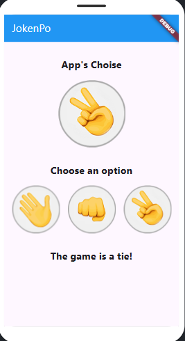
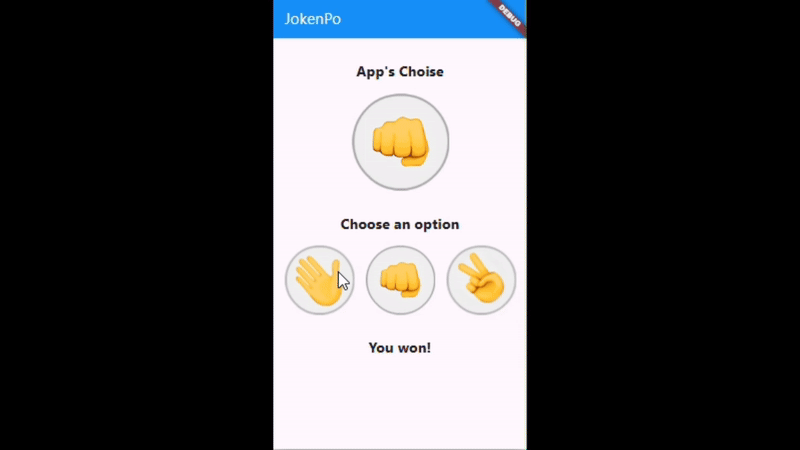

# JokenPo in Flutter

## Project Description

This is a Flutter-based application that allows users to play JokenPo (rock, paper, scissors) against the app. The project follows best development practices using Material Design and a modularized structure for better understanding and code organization.

## Features

- Intuitive interface.
- Choice of moves between rock, paper, and scissors.
- Display of the app's choice.
- Indication of the winner.

## Technologies Used

- Flutter
- Dart
- Material Design

## How to Run the Project

1. Clone the repository:

```bash
  git clone https://github.com/jp9141joao/rock-paper-scissor.git
```

2. Navigate to the project folder:

```bash
  cd jokenpo-flutter
```

3. Install dependencies:

```bash
  flutter pub get
```

4. Run the application:

```bash
  flutter run
```

## Project Structure

```
/lib
  |-- main.dart  # Main application file
  |-- game.dart  # File containing game logic
/assets/images
  |-- rock.png
  |-- paper.png
  |-- scissors.png
  |-- default.png
  |-- screenshot-app.png
  |-- gif-demostration-app.gif
```

## Images and Demonstration

### Screenshots:



### Demonstration Video:



